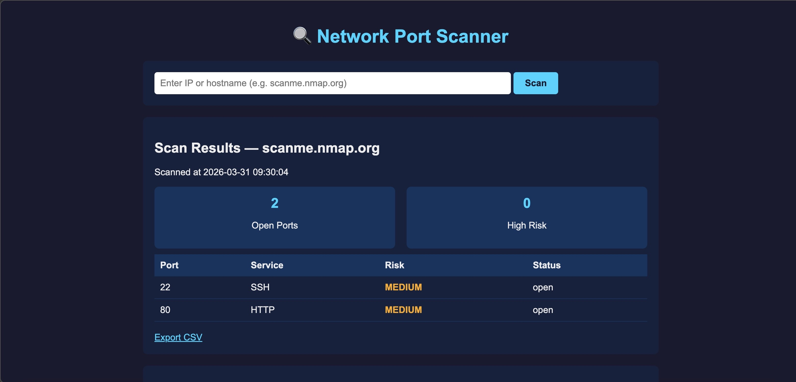

# Network Port Scanner 🔍


A Python-based network port scanner that identifies open ports, maps services, and flags high-risk exposures through a web dashboard.

## Screenshots


## Features
- TCP port scanning across common security-relevant ports
- Service identification (SSH, HTTP, RDP, SMB, FTP, and more)
- Risk classification — HIGH, MEDIUM, LOW based on exploit likelihood
- Web dashboard with real-time scan results
- Scan history tracking across multiple targets
- CSV export for reporting

## Tech Stack
- Python 3
- Flask
- Socket (built-in Python networking library)

## Setup
Clone the repository and navigate into it, then create and activate a virtual environment and install dependencies from requirements.txt.

## Usage
Set your PYTHONPATH to the project root, then launch the dashboard with python3 dashboard/app.py. Open your browser at http://127.0.0.1:5000. Enter any IP address or hostname to scan.

## Testing
Automated test suite built with pytest covering:
- Route availability and response validation
- Service identification logic
- Risk classification for HIGH, MEDIUM, and LOW ports
- Closed port scan verification

Run tests:
```bash
python3 -m pytest tests/ -v
```

## Author
ShayVon Ballard
- GitHub: https://github.com/shayvon-ballard